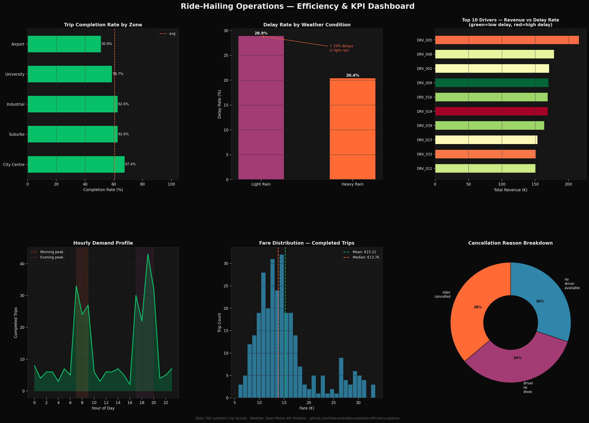

# 🚗 Ops Efficiency Pipeline

A Python data pipeline that ingests ride-hailing operations data, enriches it with real-time weather via a public API, stores it in a SQL database, and produces an analytical dashboard with KPIs and efficiency metrics.

---

## 📊 Dashboard Preview



---

## 📌 Project Purpose

Demonstrates end-to-end data engineering and analytics skills:
- **Python** — modular, PEP8-compliant, type-hinted code
- **REST API** — live weather enrichment via [Open-Meteo](https://open-meteo.com/) (no key required)
- **Pandas** — data ingestion, cleaning, transformation, aggregation
- **SQL (SQLite)** — schema design, INSERT, SELECT, JOIN, GROUP BY, window functions
- **Matplotlib** — multi-panel KPI dashboard with storytelling annotations
- **Unit Tests** — pytest coverage for core transformation logic

---

## 🗂️ Project Structure

```
ops-efficiency-pipeline/
│
├── pipeline/
│   ├── __init__.py
│   ├── ingest.py          # Simulates raw trip data (seed-controlled, reproducible)
│   ├── api_client.py      # Fetches real weather data from Open-Meteo API
│   ├── transform.py       # Pandas cleaning, feature engineering, KPI calculation
│   └── db.py              # SQLite schema creation, load, and query layer
│
├── analysis/
│   ├── __init__.py
│   └── dashboard.py       # Matplotlib multi-panel KPI dashboard
│
├── tests/
│   ├── __init__.py
│   └── test_transform.py  # Pytest unit tests for transformation logic
│
├── data/                  # Auto-generated: raw CSVs + SQLite database
├── output/                # Auto-generated: dashboard PNG
│
├── main.py                # Orchestrator — runs the full pipeline end-to-end
├── requirements.txt
└── README.md
```

---

## 🚀 Quick Start

```bash
# 1. Clone and enter the project
git clone https://github.com/<your-username>/ops-efficiency-pipeline.git
cd ops-efficiency-pipeline

# 2. Create a virtual environment
python -m venv venv
source venv/bin/activate        # Windows: venv\Scripts\activate

# 3. Install dependencies
pip install -r requirements.txt

# 4. Run the full pipeline
python main.py

# 5. Run tests
pytest tests/ -v
```

After running, check:
- `data/rides.db` — the populated SQLite database
- `output/dashboard.png` — the KPI analytics dashboard

---

## 📊 What the Pipeline Does

```
[1] INGEST      Generates 500 simulated ride records (city, driver, duration, fare, status)
      ↓
[2] API ENRICH  Fetches real historical hourly weather for Kraków from Open-Meteo
      ↓
[3] TRANSFORM   Cleans data, engineers features (delay flag, fare/min efficiency,
                peak hour, weather bucket), calculates driver-level KPIs
      ↓
[4] SQL LOAD    Writes trips + weather tables to SQLite; runs analytical SQL queries
      ↓
[5] DASHBOARD   Renders 6-panel Matplotlib figure: completion rate, efficiency by
                weather, top drivers, hourly demand, fare distribution, delay root cause
```

---

## 🔑 Key Metrics Produced

| Metric | Description |
|---|---|
| `completion_rate` | % of trips completed vs cancelled |
| `fare_per_minute` | Revenue efficiency per trip minute |
| `delay_rate` | % of trips exceeding expected duration |
| `peak_hour_share` | % of demand in 07–09 and 17–20 windows |
| `weather_impact_score` | Avg delay rate delta in rain vs clear conditions |

---

## 🛠️ Tech Stack

| Tool | Version | Role |
|---|---|---|
| Python | 3.10+ | Core language |
| Pandas | 2.x | Data manipulation |
| Requests | 2.x | REST API calls |
| SQLite3 | stdlib | SQL database |
| Matplotlib | 3.x | Visualisation |
| Pytest | 7.x | Unit testing |

---

## 💡 Design Decisions

- **SQLite over Postgres** — zero-dependency setup for reviewers; schema is portable to any RDBMS
- **Open-Meteo** — free, no API key, returns structured JSON; demonstrates real HTTP + JSON parsing
- **Seed-controlled data generation** — reproducible results across machines (`numpy.random.seed(42)`)
- **Modular pipeline** — each stage (`ingest → transform → load → analyse`) is independently testable

---

*Built by Aliaksandra Navasiad as a portfolio project demonstrating Python, SQL, and API skills.*
